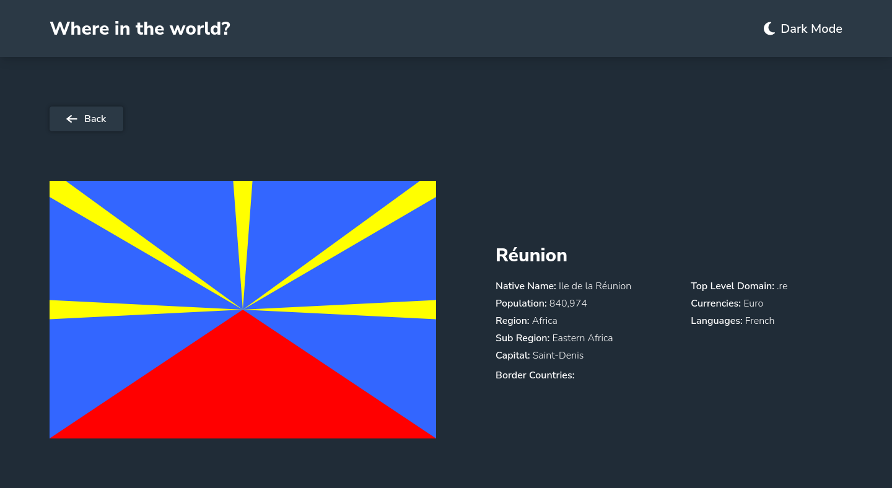
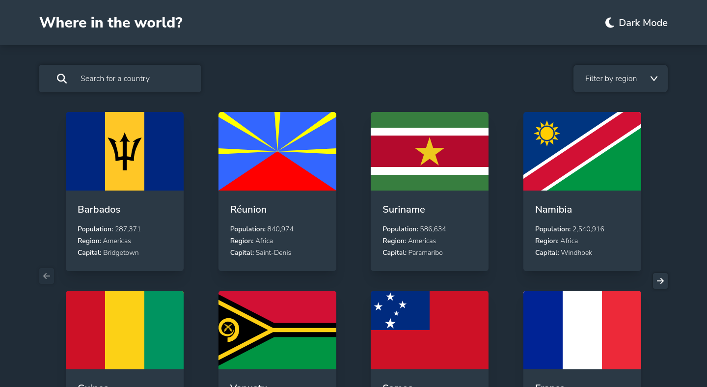
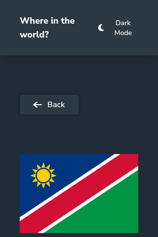
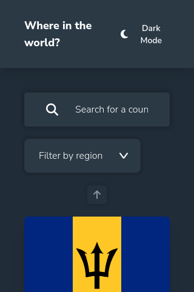
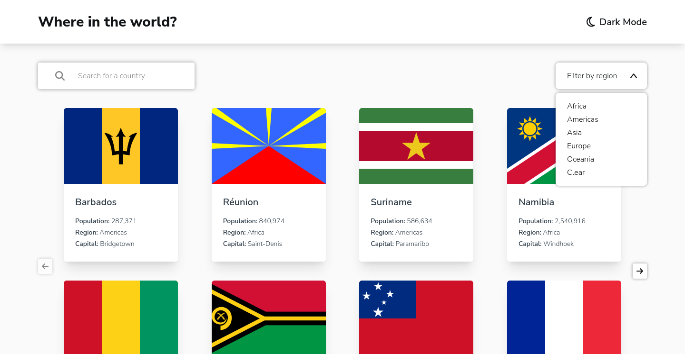
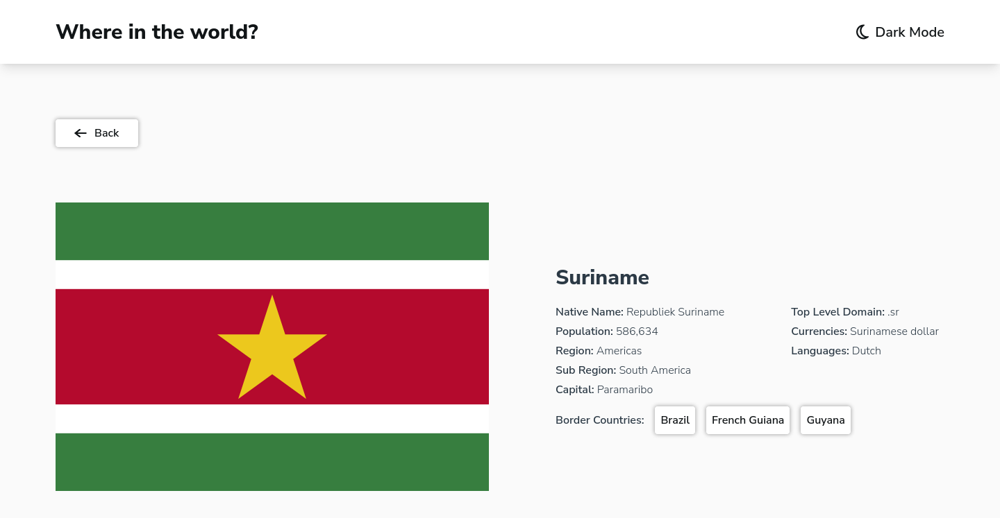

# Frontend Mentor - REST Countries API with color theme switcher solution

This is a solution to
the [REST Countries API with color theme switcher challenge on Frontend Mentor](https://www.frontendmentor.io/challenges/rest-countries-api-with-color-theme-switcher-5cacc469fec04111f7b848ca).
Frontend Mentor challenges help you improve your coding skills by building realistic projects.

## Table of contents

- [Overview](#overview)
    - [The challenge](#the-challenge)
    - [Screenshot](#screenshot)
    - [Links](#links)
- [My process](#my-process)
    - [Built with](#built-with)
    - [What I learned](#what-i-learned)
    - [My Additions](#my-additions)
    - [Continued development](#continued-development)
    - [Useful resources](#useful-resources)
- [Author](#author)

## Overview

### The challenge

Users should be able to:

- See all countries from the API on the homepage
- Search for a country using an `input` field
- Filter countries by region
- Click on a country to see more detailed information on a separate page
- Click through to the border countries on the detail page
- Toggle the color scheme between light and dark mode *(optional)*

### Screenshot








### Links

- Solution URL: [GitHub](https://github.com/Yazeed-Idris/rest-countries-api-with-color-theme-switcher)
- Live Site URL: [GitHub Pages](https://yazeed-idris.github.io/rest-countries-api-with-color-theme-switcher/)

## My process

### Built with

- [React](https://react.dev/)
- [Vite](https://vitejs.dev/)
- [TailwindCSS](https://tailwindcss.com/)
- [gh-pages](https://www.npmjs.com/package/gh-pages)

### What I learned

This challenge had some hidden obstacles that made me get out of my comfort zone to be able to overcome them, such as
the dropdown filter (who knew that you cannot style the list options). Also, dark theme was a fun and new experience for
me and thanks to TailwindCSS, it was super easy. I have also made my first custom React hook as you can see in the
snippet below

```jsx
const useCountriesData = () => {

    const [countriesData, setCountriesData] = useState([])

    useEffect(() => {
        fetch("https://restcountries.com/v3.1/all")
            .then((response) => response.json())
            .then((countriesData) => {
                setCountriesData(countriesData.map((country, index) => {
                    return {
                        ...country,
                        countryIndex: index
                    }
                }));
            });
    }, [])
    return countriesData;
}
```

### My Additions

I have added two buttons that are not in the design for navigating the main page countries.

### Continued development

The site could use some more styling and fine-tuning. The cards navigation could be improved two by making a slider or
loading the rows below each other

### Useful resources

- [Stack Overflow](https://stackoverflow.com/) - This site is the first place I look for answers about a problem I'm
  facing.
- [React Dev](https://react.dev/) - The React dev site was very helpful in my learning experience with react.

## Author

- Github - [@Yazeed-Idris](https://github.com/Yazeed-Idris)
- Frontend Mentor - [@Yazeed-Idris](https://www.frontendmentor.io/profile/Yazeed-Idris)
- LinkedIn - [@Yazeed Idris](https://www.linkedin.com/in/yazeed-idris/)
